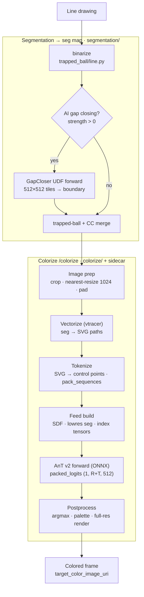

# Colorizer (AnT v2) — serving & tokenization

How a colorize request becomes per-segment colors, and how the pipeline runs
without Python. Training code is not part of this repo;
segmentation in `docs/segmentation.md`.

## Motivation

The product goal: downloadable Windows/mac binaries where users pick either a
**hosted server URL** or **local processing** — with no Python runtime in the
app. Local processing means the ONNX-exported models under ONNX Runtime
(CUDA on NVIDIA, CoreML on Apple silicon, DirectML on Windows) plus a Rust
port of every classical stage, all speaking the same HTTP contract the app
already uses. The hosted path stays the reference implementation.

## The pipeline (either implementation)

`/colorize` request → response:

1. **Decode** base64-PNG URIs (cv2 semantics → BGRA channel order end-to-end).
2. **Image prep** (`colorize/common/image.py::prepare_image`): bbox crop
   (padding 10, Pillow≥10 alpha-only getbbox), proportional **nearest**
   resize to 1024 (scipy-ndimage-zoom semantics — there is no bilinear
   anywhere), seg-id preservation for vtracer, pad to square.
3. **Vectorize** the resized seg map with the vendored vtracer fork
   (`third_party/vtracer`, colormode `seg`, spline mode) → SVG paths, one per
   segment.
4. **Tokenize** (`colorize/ant_v1..v2/tokenizer_*.py`): SVG d-strings →
   per-path (commands, 3, 2) control-point tensors, normalized by viewbox;
   `pack_sequences` greedily packs variable-length paths into rows with a
   block-diagonal attention mask; palette + `mask_null_color_ids` produce the
   color-id tensors.
5. **Feed build** (`serving/onnx/export_ant_v2.py::build_feed`): index
   tensors (`flat_idx`, `cmd_slot_idx`, `slot_counts`, `packed_gather_idx`,
   `packed_attn_mask`), SDF (integer-exact EDT; degenerate all-True input
   takes a documented ramp branch), NEAREST_EXACT seg lowres, f32 casts.
6. **AnT v2 forward** (ONNX or torch): per-segment logits over the palette.
7. **Postprocess**: id clamp, palette colors, normalized-entropy confidence,
   full-resolution renders.

End to end, from a raw line drawing (the segmentation sub-flow that produces
the seg map is detailed in `docs/segmentation.md` / `docs/gap-closer-serving.md`):

## ONNX export & the graph

`serving/onnx/export_ant_v2.py` wraps the torch model for export (the
checkpoint it loads — `v2-encoder-pretrained-large-tb-aug-7750`, the parity
anchor — is published as `ant_v2_tb-aug-7750.tar.gz` on the `checkpoints-v1`
GitHub release):

- `torch_scatter.scatter(reduce='mean')` is replaced by a bit-identical
  native `scatter_add` + counts implementation (exports as
  `ScatterElements(reduction='add')`).
- SVG packing holds **multiple path segments per row**; the wrapper
  redistributes per-command features via `flat_idx`/`cmd_slot_idx`/
  `slot_counts` index tensors (dynamic per input).
- One `packed_gather_idx` over the concatenated [ref, target] slot axis and a
  real `packed_attn_mask` let the graph be **bucket-padded**: pads sit at the
  end, so RoPE positions of real tokens never move.

**Shape bucketing (CoreML needs static shapes):** `CORPUS_BUCKET`
(slots 256 / rows 64 / cmds 256 / flat 8192 / length 512) covers real drawings with
one shape; `pad_feed_to_bucket` pads any feed into it. A bucket-pinned copy
of the .onnx compiles ONCE and serves every request; outputs are sliced at
`[n_ref .. n_ref+n_tgt)`.

## Parity infrastructure (the trust chain)

Everything is anchored to the production GPU forward on the robot corpus
(12 real drawings from a .cdm project, 11 ref→target pairs, criterion =
per-segment color-id argmax):

1. `serving/onnx/parity_corpus.py` (CUDA box): production forward → reference
   logits/ids; ONNX runs against them; `--dump` writes per-pair npz bundles
   containing every graph input (dynamic AND bucketed) + the references.
2. `serving/onnx/parity_replay.py` (any machine): replays the bundles on
   CPU/CoreML/DirectML EPs — no checkpoint, no CUDA, no Python pipeline
   needed on the target.
3. Stage goldens for every classical port (`serving/tools/dump_*_goldens.py`)
   are replay-asserted against production and, where applicable, byte-anchored
   to those same bundles.
4. `serving/tools/dump_http_goldens.py` records full request/response pairs
   from the production server; the sidecar's `verify_http` must reproduce
   them field-for-field.

Current status: **11/11 pairs 100% argmax on every backend tested** — wallace
CUDA & CPU, mac CPU & CoreML (dynamic and bucketed), Windows T4 DirectML
(dynamic and bucketed) — and the sidecar's HTTP responses are exact
(including rendered images, by decoded pixels) on all 36 recorded steps.

## Execution providers (measured, 1024×1024, fp32)

| Backend | AnT forward | Notes |
|---|---|---|
| RTX 3090 CUDA | ~0.5 s | hosted reference |
| M3 Max CoreML (GPU) | ~0.75 s | fp32; ANE can't take the full graph and fp32 won't run on it — not worth chasing on Max-class chips |
| M3 Max CPU | ~3.7–4 s | fallback |
| T4 DirectML | ~6.0–6.3 s | 11/11 exact; the Windows EP of record (no CUDA DLLs to ship) |
| 4-vCPU x86 CPU | ~16–18 s | floor |

Sidecar route times (mac): `/colorize` ≈ 1.9–2.1 s on CoreML vs ≈ 4.9 s CPU.

Known EP workarounds (all encoded in the export/replay scripts): CoreML
requires post-hoc dim pinning (dynamic dims crash its compiler); naive fp16
conversion must block-list `ScatterElements`; ORT's SimplifiedLayerNorm
fusion crashes on the fp16 llama graph (`ORT_ENABLE_BASIC`).

## The Rust sidecar

`serving/sidecar/` is the python-free implementation: axum server exposing
`/health /segment /preprocess /colorize /predict` with the exact production
contract (cv2 vs PIL codec fidelity, URL-safe-accepts-standard base64,
`return_colorized` defaulting). Engine (`src/serve/engine.rs`) selects EPs:
`--ep auto|cpu|coreml|dml`; CoreML uses the bucket-pinned model with CPU
fallback for feeds exceeding the bucket. Every classical stage lives in its
own verified module (`segment/`, `imageprep/`, `tokenize/`, `postprocess/`)
with a `verify_*` bin gating it against goldens — run them all after any
change to those modules.

The postprocess entropy is reproduced **bitwise** against production
torch-2.6-CPU (scalar SLEEF exp/log ports, torch's sum-kernel interleave,
an MKL-VML ln bits table) — see `src/postprocess/`.

## Quirks & gotchas

- **Channel order is cv2's.** `/colorize` and `/segment` decode via cv2 →
  line images are BGRA through the whole pipeline; response renders are
  R/B-swapped at encode. `/preprocess` is PIL (RGBA) both ways, and its
  inputs are URL-safe base64 while its output URI is standard.
- **Z commands in SVG d-strings are silently dropped** by the tokenizer's
  parser; vtracer output relies on it. `translate(0,0)` transforms rewrite
  `-0.0` to `+0.0` — bitwise load-bearing.
- The tokenizer truncation path (>256 commands/path) uses `np.random` and is
  NOT ported — the sidecar asserts instead (corpus max is 216).
- macOS vs Linux vtracer output differs on some drawings (ulp-level libm in
  spline fitting — numeric ±1 or a subdivision flip). Per-platform
  self-consistency is the contract: vectorization always runs on the same
  machine as the model, and colorize argmax stayed exact despite the drift.
- Production env drift bites: wallace runs torch 2.6.0 / Pillow 11 / scipy
  1.12 / numpy 1.26 (pyproject pins now mirror this — don't bump casually,
  the goldens encode these versions' semantics).
- ort-rs rc.12 bundles ONNX Runtime 1.24 → the CoreML compile takes ~106 s
  one-time (42 partitions); ORT 1.27 does it in 1.7 s. Bump ort when a newer
  rc ships; consider `ModelCacheDirectory` to persist compiles.

## Open work

Tracked centrally in [todo.md](todo.md) (serving/sidecar + release sections).
