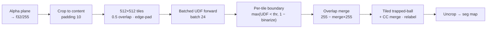

# GapCloser — serving

How the ML gap-closing model runs at inference time, in both the Python
server and the Rust sidecar. Training code is not included in this repo; the
classical segmentation it feeds is in `docs/segmentation.md`.

## Motivation

Trapped-ball segmentation closes only gaps smaller than its ball radius.
Real drawings have larger gaps (sketchy joins, open corners) that make
regions leak into each other. The GapCloser — a UNet predicting a normalized
**unsigned distance field (UDF)** to the nearest intended line — closes those
gaps before segmentation. It is behind the app's "AI Gap Closing" toggle
(default OFF; `gap_closer_strength ≤ 0` skips it entirely).

## Inference pipeline

`serving/handlers/segment.py::run_segment` →
`segmentation/gap_closing/inference.py::process_image` →
`GapCloser.predict` (`segmentation/gap_closing/gap_closer.py`):

1. Alpha plane → f32/255, **crop to content** (`crop_image`, padding 10).
2. 512×512 tiles at 0.5 overlap, edge-padded (`np.pad mode='edge'`), outer
   2 px stamped to 1.0 so edge regions close.
3. Batched forward (production batch 24). Per tile the boundary is
   `max(UDF_denorm < udf_threshold, 1 − binarize(tile)/255)` — i.e. the
   thresholded prediction OR'd with the classical binarization of the tile.
   `udf_threshold` is the app's `gap_closer_strength` (default 1.0);
   `udf_max_dist` is 10.0.
4. Overlap-tile merge → `255 − merge×255` (lines 0, background 255).
5. Tiled trapped-ball + connected-components merge (`compute_seg_full`,
   see `docs/segmentation.md`), relabel, uncrop.

## Model artifacts & execution providers

The checkpoint (`gap_close_v1_1229.ckpt`, published as an asset of the
`checkpoints-v1` GitHub release) exports to ONNX
(`serving/onnx/export_gap_closer.py`). Measured results on the 12-drawing
robot corpus:

| EP | Config | Result |
|---|---|---|
| CPU (any) | fp32, batch-1 tiles | ~2.6 s per full drawing in the sidecar — the shipping default |
| CPU | fp32 b24 (one batch) | ~20 s (mac) / 255 s (4-vCPU EC2) — why GPU matters for strength>0 |
| CoreML (mac) | fp32 b24 | 1.26 s |
| CoreML (mac) | fp16+ANE b24 | 802 ms |
| DirectML (T4) | fp16 b24 | **719 ms** |
| DirectML (T4) | fp32 b24 | unreliable on a 16 GB/WDDM box (system-commit OOM) — use fp16 |

**Parity:** the fp32 ONNX model's thresholded boundaries are pixel-identical
to production torch-CUDA on all 12 corpus drawings (0 flips in 9.4 M tile
pixels) — verified by `verify_gapclose --onnx`. The classical glue around it
is byte-exact (same bin). The **fp16** export (Windows/DirectML) is not
bit-exact but boundary-safe vs the fp32 anchor on real line tiles
(`serving/onnx/verify_gap_fp16.py`): **10 flips in 10.5 M pixels (99.999905%)**
on the CPU-fp16 proxy, and **18 flips (99.999828%)** on the actual
DirectML EP on a T4 — isolated threshold-straddling pixels the trapped-ball
segmentation downstream absorbs.
The fp32 ONNX re-exported from the checkpoint is byte-identical to the shipped
`gap_closer_fp32.onnx` (same sha256), so the export path reproduces production.

## The Rust sidecar path

`serving/sidecar/src/segment/tiled.rs::gap_close_stages` implements the
whole predict body; `serve/segment_impl.rs` wires it behind `/segment`. The
UDF model runs via ort: the CPU EP forwards one 512×512 tile per call (the
byte-exact golden path), and `--gap-model-bucket` enables a batched
accelerator path (`Engine::run_gap_udfs` → `run_gap_accel`) that forwards
tiles in fixed batches of 24 — **CoreML on macOS** (the fp32 batch-pinned
export) and **DirectML on Windows** (the fp16 export; fp32 batches OOM a 16 GB
WDDM card). Both exports take float32 I/O (`keep_io_types`), so one forward
serves both EPs; either falls back to the CPU EP on any build/init error. The
empty-alpha branch, u8
label cast, and `num_segments` counting quirks of the Python handler are
replicated exactly (gated by the recorded HTTP goldens).

## Quirks & gotchas

- The **fp16 export has `keep_io_types`** — inputs/outputs are float32 even
  though internals are fp16. Feeding float16 fails with a type error.
- The per-tile binarize inside `forward` runs on the 512×512 *tile* (border
  replication at tile edges), not the full image — a Rust port that binarizes
  globally will not match.
- `boundary_binary` values are exactly {0.0, 1.0}; goldens store them as u8.
- Two different label-offset constants exist: `compute_seg_full` uses
  `max_seg_id = tiles×512` but offsets tiles by `tile_id×256`
  (`compute_seg_partial` uses ×256 for both) — a >256-segment tile would
  collide. Preserved as-is.
- On Windows/WDDM boxes, system RAM pressure (e.g. Windows Update) can fail
  DML allocations that normally succeed — reboot the rig before benching.
- **The DirectML EP needs a modern `DirectML.dll` shipped next to the sidecar
  exe.** Windows' system copy (1.4.0 on the Server 2022 image) is too old and
  fails session creation with `887A0004` (`DXGI_ERROR_UNSUPPORTED`), so the
  sidecar silently falls back to CPU — `/health` shows `segment.active = "cpu"`
  with that reason. Packaging ships Microsoft's redistributable (fetched by
  `scripts/fetch-directml.ps1`); the exe dir is searched before System32. This
  was invisible to unit tests, the Windows compile, and Python-ORT parity — only
  the on-hardware `/health` check on the rig caught it.

## Open work

Tracked centrally in [todo.md](todo.md) (serving/sidecar section).
